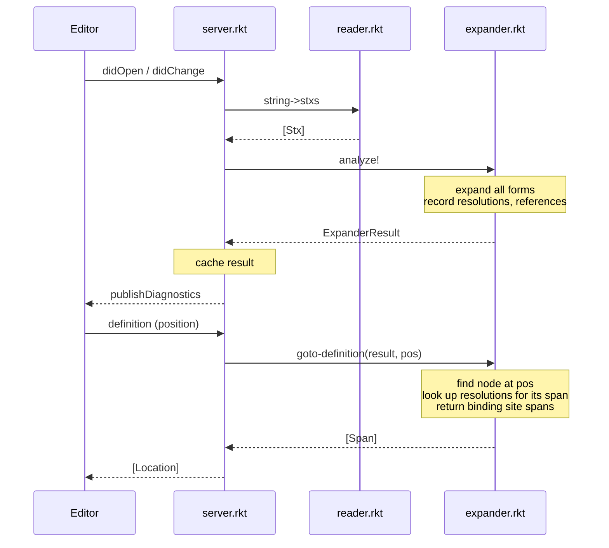

# treason

Racket has powerful hygienic macros but notoriously poor IDE support. treason is a research language that explores what it takes to build a Lisp with hygienic macros *and* a great IDE experience.

The core insight is that IDE services must be **fault-tolerant** — they need to keep working even when the program has errors, which is most of the time while you're writing code. treason's expander never gives up: it continues expanding past syntax errors, collects all of them, and still provides accurate goto-definition, find-references, and autocomplete on the parts that are well-formed.

Currently, this repository contains a language server and expander for the treason language, but cannot actually run treason code, and there is no CLI for the expander, only the language server.

### Key Features

- IDE services (goto-definition, find-references, autocomplete) work even when the program has syntax errors
- Multiple syntax errors reported at once, not just the first one
- All IDE services are macro-aware — they track use-site source spans through expansion, so goto-definition and find-references work on macro-defined and macro-used identifiers
- Goto-definition and find-references work on `syntax-rules` pattern variables in macro templates, even if the macro is never called
- Scope-aware autocomplete with full hygiene — macro-introduced bindings are not included from autocomplete at use-sites

## Language

treason is a small Lisp with hygienic macros. The grammar:

A program is a sequence of expressions.

```
program := expr ...

expr := number
      | boolean
      | var
      | (let ([var expr]) expr)
      | (let-syntax ([name macrot]) expr)
      | (block def-or-expr ...)
      | (name expr ...)          ; macro application

def-or-expr := expr
             | (define var expr)
             | (define-syntax name macrot)
             | (begin def-or-expr ...)
             | (name expr ...)          ; macro application

macrot := (syntax-rules (literal ...) [pattern template] ...)

; patterns (no ellipsis support yet)
pattern := _
         | pvar
         | literal
         | (pattern ...)

; templates (no ellipsis support yet)
template := pvar              ; pattern variable reference
          | var               ; literal identifier (introduced by the macro)
          | number
          | boolean
          | (template ...)
```

Supported forms: `let`, `let-syntax`, `define`, `define-syntax`, `block`, `begin`, `syntax-rules`.

## LSP Features

- Goto definition
- Find references
- Autocomplete
- Document symbols
- Semantic tokens (syntax highlighting)
- Diagnostics (parse errors and syntax errors)

All features work correctly through macro expansions — goto-definition and find-references track use-site spans, and autocomplete is scope-aware with hygiene.

## Architecture

The pipeline is: **source text → reader → stx → expander → ExpanderState → LSP operations**

### Flow

Two things happen at different times. When the document changes, the server re-analyzes it and caches the result. When the editor requests goto-definition, the server queries that cached result.



### Key Design Properties

- **Fault-tolerant expansion**: the expander continues after errors (unbound variables, bad syntax) and emits `stx-error` nodes. LSP features work even in incomplete or broken programs.
- **Hygienic macros**: scope graphs with marks ensure macro-introduced bindings don't capture surface identifiers and vice versa.
- **Pattern variable LSP support**: goto-definition, find-references, and autocomplete work on `syntax-rules` pattern variables in templates, even if the macro is never called.
- **Cursor-driven autocomplete**: autocomplete inserts a synthetic cursor node and re-expands to find names in scope at that position.

### Modules

- **`server.rkt`** — JSON-RPC LSP server. Implemented as a class wrapped by a thin JSON-RPC conversion layer. When an IDE user opens or edits a file, the file is parsed and expanded, and all static information (like bindings and resolutions) from expansion is cached. These cached results are used for LSP operations like goto definition.

- **`expander.rkt`** — Hygienic macro expander using scope graphs and marks. Key ideas:
  - Scope Graphs: The expander uses scope graphs. Each scope has bindings and a parent scope. Macro usages create a "disjoin" scope with two parents: one for use-site bindings and one for macro-introduced bindings. These are distinguished using marks on identifiers. Binding resolution involves traversing up the scope graph, popping marks on disjoin scopes, in search of a matching binding.
  - Bindings: `var-binding`, `keyword-binding`, `macro-binding`, `pattern-variable-binding` — each records its `site` identifier for LSP
  - `ExpanderState` (a parameter): The expander accumulates static information in mutable tables, and this information. Each table is keyed by source span since LSP operations are in terms of source locations:
    - `resolutions` — maps each reference span to the binding(s) it resolved to, along with a snapshot of the scope at that point; used by goto-definition and autocomplete
    - `references` — maps each binding site span to all reference stx nodes that resolved to it; used by find-references
    - `bindings` — maps each binding site span to its binding; used to distinguish binding sites from reference sites and for semantic tokens
    - `stx-errors` — the set of all syntax errors encountered during expansion; published as diagnostics
  - Two-pass definition expansion: pass 1 discovers all bindings (enabling forward references), pass 2 expands expressions
  - `analyze!` is the main entry point; returns an `ExpanderResult`, containing information including tables found in `ExpanderState`

- **`reader.rkt`** — Custom s-expression parser (`string->stx`, `string->stxs`) that produces `stx` trees with full source spans. Supports `()`, `[]`, dotted pairs, `#t`/`#f`, `'quote`, and `;` comments. Raises `exn:fail:parse` on errors.

- **`stx.rkt`** — Core data definitions. A `stx` wraps a `StxE` (symbol, number, bool, null, or cons pair) with a `span` (start/end `loc`) and hygiene `marks`.

- **`stx-quote.rkt`** — Quasiquote-style syntax construction helpers: `stx-quote` (pattern matching and quoting) and `stx-rebuild` (quasisyntax/loc for updating subexpressions while preserving source spans).

- **`constants.rkt`** — LSP protocol numeric constants (`SymbolKind/Variable`, `TextDocumentSyncKind/Full`, `DiagnosticSeverity/Error`, etc.)

- **`server-logging.rkt`** — File-based logging via `log-server-info` / `log-server-error` (writes to `logs.txt`).

### Test Files

- **`lsp-tests.rkt`** — Integration tests for LSP operations. Tests call `goto-definition`, `find-references`, and `autocomplete` directly on source strings.
- **`reader-tests.rkt`** — Unit tests for the reader.

## Usage

```bash
# Install the package locally
raco pkg install --auto

# Run all tests
raco test -p treason

# Run tests for a specific file
raco test lsp-tests.rkt
raco test reader-tests.rkt

# Run the language server (reads JSON-RPC from stdin)
racket server.rkt
```

To use in an IDE, use the [vscode extension](https://github.com/quasarbright/treason-vscode)
